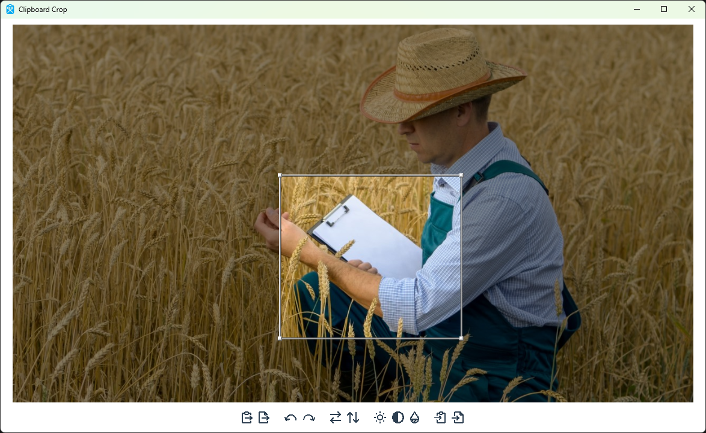

# Clipboard Crop

**Clipboard Crop** is a Windows application written with .NET that allows you to easily crop images in your clipboard and to save them back to your clipboard.

## Main Features
* Loading an image from a file
* Cropping, rotating, and flipping the image
* Saving the image to the clipboard to a file

## Image

## Building
Clipboard Crop can be built using Visual Studio with .NET as well as NSIS. To produce a publishable version of the app, publish the main project in Visual Studio. Note this will automatically run `makensis NSIS.nsi` to create the installer.
